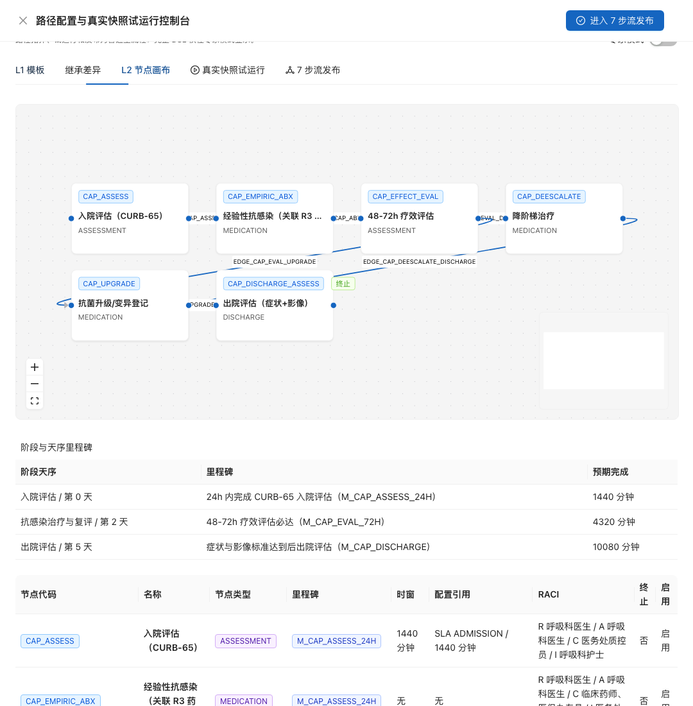

# MedKernel · 临床运行用户手册

> 状态：已由全流程演练幕5-6激活 · 临床路径配置、图形阅读、运行态推荐和医生闭环已补齐
> 适用：临床医生 / 护士 / 科主任 / 专科专家 / 医务处质控员
> 证据：幕5真实演练归档在 [CAP 临床路径证据](../../release/evidence/v1.0-drill-20260611/幕5-CAP临床路径/README.md)；幕6真实演练归档在 [推荐引擎全链证据](../../release/evidence/v1.0-drill-20260611/幕6-推荐引擎全链/README.md)

---

## 1. 临床路径

### 1.1 这页给谁干什么

临床路径给临床牵头人、专科专家和医务处质控员使用。目标是把一个病种的标准诊疗过程建成可审核、可发布、可在医生端阅读的路径模板，并保留每个节点、里程碑和分支的证据。

本章覆盖两类入口：

| 页面 / 接口 | 入口 | 用途 |
|---|---|---|
| 路径中枢 | `/pathway/templates` | 建路径模板、维护节点和流转边、执行真实快照试运行、发布模板 |
| 患者路径 | `/patient-pathways` | 医生运行态查看患者路径和待办；幕6已验证患者入 CAP 路径 |
| 路径只读接口 | `/medkernel/api/v1/engine/pathway/pathway-templates/{templateId}` | 医生按权限读取已发布模板详情 |

浏览器入口不带 `/medkernel` 前缀；`/medkernel/api/v1/*` 只用于后端 API。

### 1.2 幕5 CAP 路径

幕5在 134 上发布了 CAP 社区获得性肺炎临床路径模板：

| 项 | 值 |
|---|---|
| 路径知识包 | `PATH.DRILL.CAP@2026.06.11-act5-1781126077791` |
| 模板代码 | `TPL.DRILL.CAP.1781126077791` |
| 模板 ID | `pt-e8b9a1f1-f423-44aa-ba6c-835c7246c186` |
| 病种代码 | `ZD0456` |
| 状态 | 已发布 |

路径图包含 6 个节点：入院评估（CURB-65）、经验性抗感染、48-72h 疗效评估、降阶梯治疗、抗菌升级 / 变异登记、出院评估。流转边覆盖两条主线：

| 分支 | 轨迹 |
|---|---|
| 疗效改善 | `CAP_ASSESS -> CAP_EMPIRIC_ABX -> CAP_EFFECT_EVAL -> CAP_DEESCALATE -> CAP_DISCHARGE_ASSESS` |
| 疗效不佳 / 变异 | `CAP_ASSESS -> CAP_EMPIRIC_ABX -> CAP_EFFECT_EVAL -> CAP_UPGRADE -> CAP_DISCHARGE_ASSESS` |

### 1.3 默认看到什么

| 区域 | 默认状态 | 幕5实证 |
|---|---|---|
| 筛选区 | 按状态、病种编码、路径知识包筛选 | `ZD0456` 可筛到 CAP 模板 |
| 模板列表 | 展示模板代码、路径名称、关联病种、版本、状态 | `TPL.DRILL.CAP.1781126077791` 展示为已发布 |
| L2 节点画布 | 展示节点、边线、里程碑和节点表 | 6 个节点、6 条只读流转边、12 个只读连接点 |
| 真实快照试运行 | 展示路径轨迹和最终状态 | 降阶梯和升级两条轨迹均为 `COMPLETED` |

详情态的路径图只读展示节点和边线，不暴露删除节点按钮。幕5发现过只读图缺少连接点导致边线不显示的问题，已通过 TDD 修复并重新发布前端到 134。

### 1.4 七步流操作

| 步骤 | 操作 | 通过信号 |
|---|---|---|
| 1 | 确认路径知识包 | `PATH.DRILL.CAP` 包存在，病种为 `ZD0456` |
| 2 | 创建路径模板 | 模板生成 `templateId`，名称和病种可在列表中查到 |
| 3 | 建 L2 节点画布 | 6 个节点和 6 条流转边可在画布和表格中互相对照 |
| 4 | 配置里程碑 | 24h 入院评估、48-72h 疗效评估、出院评估都有目标时间 |
| 5 | 执行路径试运行 | 降阶梯和升级分支均返回 `COMPLETED` |
| 6 | 发布模板 | 发布门禁接受结构化电子签名和质量门禁证据 |
| 7 | 图形阅读评审 | 质控员 / 专科专家在 L2 画布可按图口述完整路径 |

每一步的 API 响应、traceId、页面截图和发布记录见 [幕5证据 README](../../release/evidence/v1.0-drill-20260611/幕5-CAP临床路径/README.md)。

### 1.5 权限边界

| 角色 | 能做什么 | 幕5结果 |
|---|---|---|
| 呼吸科医生 | 读取已发布路径详情，在运行态患者路径页查看患者路径，并处理推荐卡反馈 | 有 `pathway.read`、`recommendation.read` 和 `patient-pathways` 菜单，没有 `pathway-templates` 配置菜单 |
| 专科专家 | 审阅配置图、参与模板设计 | 有 `pathway.read`、`pathway.write` 和 `pathway-templates` 菜单 |
| 医务处质控员 | 建模、试运行、发布和截图验收 | 有 `pathway.read`、`pathway.write`、`pathway.publish` |

医生没有路径配置页不是缺陷。配置入口属于专科专家、科主任和医务处；医生运行态入口在患者路径页，幕6继续验证。

### 1.6 出错怎么办

| 现象 | 常见原因 | 处理 |
|---|---|---|
| 医生看不到路径配置页 | 医生角色没有配置菜单 | 改从 `/patient-pathways` 查看运行态；配置变更交给科主任 / 专科专家 |
| 路径图只有节点没有边 | 详情态连接点缺失或前端资源未更新 | 保留截图和 `05-ui-screenshot-check.json`，确认前端发布记录和边线统计 |
| 发布返回 400 | 发布证据不是结构化电子签名或质量门禁对象 | 按发布表单填写签名、门禁、回滚和灰度字段，不传纯字符串 |
| 医生接口读取失败 | 角色缺少 `pathway.read`，或模板未发布 | 查 `/security/me` 和模板状态；未发布模板不得写成运行态可用 |
| 分支轨迹不符合预期 | 节点条件或边优先级配置错误 | 回到 L2 画布和边表核对 `fromNodeCode`、`toNodeCode`、条件和优先级 |

### 1.7 找谁

- 临床节点、里程碑和分支含义：呼吸科临床牵头人 / 专科专家。
- 发布门禁、模板版本和质控证据：医务处质控员。
- 页面权限和账号菜单：信息科管理员。
- 患者运行态路径、推荐和待办：呼吸科医生、心内科医生、临床药师和医务处质控员按本手册第 2 章协同处理。

---

## 2. 提醒与推荐

### 2.1 这页给谁干什么

提醒与推荐给临床医生、临床药师和医务处质控员使用。目标是把临床事件、规则命中、知识/路径来源、推荐卡、医生反馈和疲劳信号串成可追溯闭环，而不是只在后台“触发了一个规则”。

本章覆盖三类入口：

| 页面 / 接口 | 入口 | 用途 |
|---|---|---|
| 临床事件 | `/medkernel/api/v1/engine/clinical-events` | 接收 LIS/HIS 等临床事件，生成标准上下文并派发规则、路径、推荐引擎 |
| 提醒治理 | `/cdss/fatigue` | 查看推荐命中、反馈统计和疲劳信号；后续将升级为“提醒与推荐中枢” |
| 待办中心 | `/workflow/todos` | 医生查看由推荐卡等来源生成的待处理事项 |
| 通知中心 | `/notifications` | 查看面向个人的消息触达；幕6显示推荐卡待办已生成，但通知触达仍需体验重构统一 |

### 2.2 幕6真实链路

幕6在 134 上使用同一名脱敏患者完成两条推荐运行链：

| 项 | 值 |
|---|---|
| 患者 | `mpi-01KTSWK7P3XQQ8VC0JZFZ63AMY`（演练-张建国，男，64 岁） |
| 就诊 | `enc-act6-8oh7bn024a` |
| 患者路径 | `pp-9b4c8389-c46e-4a12-bf5f-6d66be5768fc` |
| 术语运行包 | `2026.06.11-act2-024101` |
| 路径包 | `2026.06.11-act5-1781126077791` |

| 场景 | 事件 | 推荐卡 | 医生反馈 | 统计结果 |
|---|---|---|---|---|
| 血钾危急值 | `evt-act6-8oh7bn024a-k-critical`，LIS 回报 `K001=6.8 mmol/L`，标准化为 LOINC `2823-3` | `rc-12c39901-6293-4704-acb9-4ee9b477f633`，CRITICAL，需医师确认 | `ACCEPTED`，原因：危急值已确认并进入人工处置闭环 | accepted `1` |
| 华法林 + 阿司匹林 DDI | `evt-act6-8oh7bn024a-ddi-warfarin-aspirin`，ATC `B01AA03` + `B01AC06` | `rc-85e2897f-c31c-4eba-b351-71f2fc4cf605`，HIGH，需医师确认 | `REJECTED`，原因：有双联治疗适应证并安排 INR / 出血风险监测 | rejected `1` |

两条链路最终统计为 `total=2`、`pending=0`、`accepted=1`、`rejected=1`。推荐卡详情可看到三类来源：标准上下文 `CONTEXT`、患者路径 `PATHWAY`、命中规则 `RULE`。

### 2.3 七步流操作

| 步骤 | 操作 | 通过信号 |
|---|---|---|
| 1 | 创建或定位患者 | MPI 有患者 ID，且患者进入当前就诊 |
| 2 | 建立标准上下文 | 上下文快照为 `ACTIVE`，术语包版本与运行态一致 |
| 3 | 患者进入路径 | 患者路径有 `patientPathwayId`，当前节点可读 |
| 4 | 注入临床事件 | 事件状态从 `RECEIVED` 到 `MAPPED` 再到 `PROCESSED` |
| 5 | 查看推荐卡 | 卡片含风险级别、建议动作、来源摘要、解释 JSON 和 `patientPathwayId` |
| 6 | 医生反馈 | 接受、拒绝、延后或关闭必须填写原因；高风险卡必须医师确认 |
| 7 | 质控/药师复核 | 统计、疲劳信号、反馈理由和 traceId 可追溯 |

### 2.4 出错怎么办

| 现象 | 常见原因 | 处理 |
|---|---|---|
| 事件 `FAILED` | 上下文包版本不存在、路径未全量发布、推荐触发编码冲突或下游读取不到快照 | 看事件诊断和 `traceId`；幕6已修复路径包/术语包解耦、事务内派发和推荐触发编码 |
| 没有推荐卡 | 规则没有进入 `FULL`，或规则 DSL 与标准上下文字段不匹配 | 用规则解释回放核对字段；幕6补建了标准 LOINC `2823-3` 血钾规则 |
| 推荐卡重复 | 历史规则重复发布 | 走正式治理状态机退役重复规则；幕6已将重复 DDI 规则退役，保留主规则 |
| 待办有、通知没有 | 推荐卡与通知触达没有统一联动 | 不伪造成失败；登记为体验重构项，后续在“提醒与推荐中枢”统一 |

### 2.5 找谁

- 临床事件、术语映射和规则命中：医务处质控员 / 规则治理负责人。
- 医生推荐卡处理：对应科室医生。
- DDI 覆盖复核：临床药师。
- 体验和入口不清：登记到 `OPT-IA-01`、`OPT-TRACE-01`，由体验重构批次统一处理。
