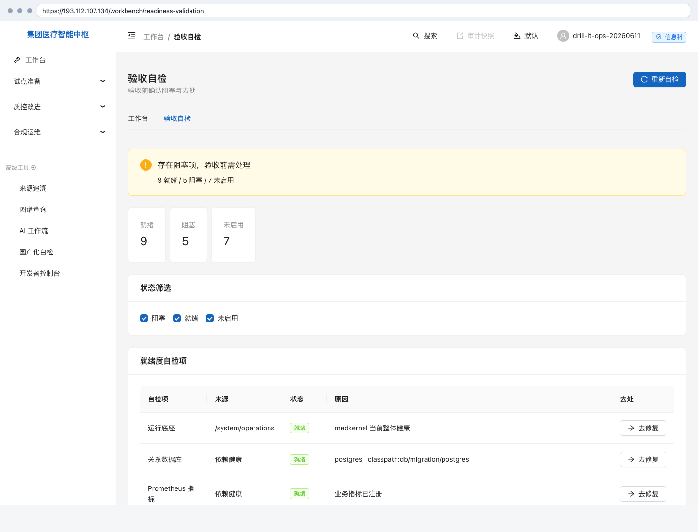

# MedKernel · 合规运维用户手册

> 状态：已由全流程演练幕0激活；幕8.5 已补齐首次部署/登录/验收自检前台复演配图；幕9已补齐适配器运维；幕10已补齐 L1 审计与降级链路，L2 页面配图待幕10前台走查回填
> 适用：信息科管理员 / 安全审计 / 乙方 SRE / 国产化驻场运维
> 证据：幕0真实演练归档在 [部署接管与首次登录证据](../../release/evidence/v1.0-drill-20260611/幕0-部署接管与首次登录/README.md)

---

## 1. 首次部署

### 1.1 这页给谁干什么

首次部署给信息科管理员和实施运维使用。目标是把一个刚启动、尚未接管的 MedKernel 系统变成可登录、可审计、可继续开租户的系统。

本章覆盖三页：

| 页面 | 入口 | 用途 |
|---|---|---|
| 首次部署接管 | `/bootstrap` | 输入接管码，创建首发平台管理员 |
| 登录页 | `/login` | 完成首登改密和 MFA 绑定 |
| 验收自检 | `/workbench/readiness-validation` | 查看全系统就绪、阻塞、未启用项 |

浏览器入口不带 `/medkernel` 前缀；`/medkernel/api/v1/*` 只用于后端 API。

### 1.2 进入入口

1. 访问 `https://<服务器地址>/bootstrap`。
2. 从服务器受限文件读取接管码，确认文件权限为仅运维账号可读。
3. 接管完成后访问 `https://<服务器地址>/login`。
4. 登录后进入 `https://<服务器地址>/workbench/readiness-validation` 查看验收自检。

幕0证据中，193.112.107.134 的首发管理员为 `drill-platform-admin-20260611`，角色为 `system-superadmin`，租户为平台主租户 `t-1`。口令和恢复码不进入仓库。

### 1.3 默认看到什么

| 页面 | 默认状态 | 判断方式 |
|---|---|---|
| 首次部署接管 | 初始化前显示接管码输入框 | `GET /medkernel/api/v1/bootstrap/status` 返回 `initialized=false` |
| 登录页 | 首次登录后强制改密 | 登录响应提示必须修改初始口令 |
| MFA 绑定 | 改密后要求绑定双因素认证 | 页面展示 TOTP 绑定与一次性恢复码 |
| 验收自检 | 展示就绪、阻塞、未启用数量和修复入口 | 幕0复验为 9 就绪 / 5 阻塞 / 7 未启用 |

验收自检中的「阻塞」不是伪失败，也不是静态红字；它表示当前系统真实缺少某项上线前置条件。例如幕0中备份恢复、外部 Provider、知识图谱投影、知识搜索投影仍需后续幕次或现场资源补齐。

幕8.5 复演时，信息科账号可从登录页进入工作台，再打开验收自检页。截图只保留页面状态，不保留密码、TOTP 秘钥或恢复码。

### 1.4 七步流操作

| 步骤 | 操作 | 通过信号 |
|---|---|---|
| 1 | 打开 `/bootstrap` | 页面能打开，未接管时 API 返回 `initialized=false` |
| 2 | 输入接管码 | 接管码校验通过，页面进入首发账号表单 |
| 3 | 创建首发平台管理员 | 系统创建 `system-superadmin` 账号，并消费接管码 |
| 4 | 使用首发账号登录 | 登录成功但被要求立即改密 |
| 5 | 修改初始口令 | `mustChangePwd=false` |
| 6 | 绑定 MFA | `mfaRequired=true` 且 `mfaBound=true` |
| 7 | 打开验收自检页 | 页面展示就绪、阻塞、未启用项，并能保留 traceId |

每一步的页面截图、API 状态码和 traceId 见 [幕0证据 README](../../release/evidence/v1.0-drill-20260611/幕0-部署接管与首次登录/README.md)。

### 1.5 出错怎么办

| 现象 | 常见原因 | 处理 |
|---|---|---|
| `/medkernel/` 返回 401 | 访问了后端根路径，不是前端入口 | 改访问 `/bootstrap` 或 `/login` |
| 接管码不可用 | 过期、已消费、环境变量未注入 | 由值班运维重新生成并写入受限文件，留审计 |
| 首登后不能继续 | 未完成改密或 MFA | 按页面顺序完成改密、TOTP 绑定 |
| 验收自检页显示权限不足 | 账号没有工作台权限，或服务器前端资源滞后 | 先查 `/security/me` 的角色和权限；若 API 权限正确，重新发布前端静态资源 |
| MFA 设备丢失 | 恢复码不可用或未妥善保管 | 走本机应急命令；工单记录操作者、原因、目标用户和 traceId，不记录恢复码明文 |

### 1.6 找谁

- 接管码、部署变量、服务器文件权限：值班运维 / 乙方 SRE。
- MFA 重置、账号解锁：安全审计负责人批准后由值班运维在本机控制台执行。
- 验收自检阻塞项：先看页面「原因」列；外部 Provider、备份恢复、知识图谱和知识搜索投影由对应实施负责人处理。
- 前端入口或权限显示与 API 不一致：保留截图、traceId、`/security/me` 响应和当前前端发布记录，交由产品工程排查。

## 2. 适配器运维

### 2.1 这页给谁干什么

适配器运维给信息科集成管理员、乙方 SRE 和安全审计使用。目标是让 HIS、LIS、FHIR 网关、质控平台等外部系统接入后，值守人员能看懂每个连接点的真实状态，并在断连时完成重试、死信和重放。

本章覆盖：

| 页面 / API | 入口 | 用途 |
|---|---|---|
| 适配器中心 | `/adapter/hub` | 查看 HIS/LIS/FHIR/Webhook 适配器、健康状态和联调单 |
| 集成健康 | `/medkernel/api/v1/engine/integration/health` | 汇总每个适配器的 `HEALTHY`、`NOT_CONNECTED`、`MISCONFIGURED`、`ERROR` |
| 出站日志 | `/medkernel/api/v1/engine/integration/logs` | 查询出站消息、重试次数、失败原因 |
| 死信队列 | `/medkernel/api/v1/engine/integration/dead-letter` | 查看超限失败消息并人工重放 |
| 第三方案例集 | [third-party-cases.md](third-party-cases.md) | 给厂商看的 6 个联调案例和报文口径 |

幕9证据中，批次 `act9-2grf0t4vdy` 创建 HIS、LIS、FHIR、质控出站四类适配器，6 个案例全部通过，证据见 [第三方对接能力案例集](../../release/evidence/v1.0-drill-20260611/幕9-第三方对接能力案例集/README.md)。

### 2.2 默认看到什么

| 状态 | 含义 | 值守判断 |
|---|---|---|
| `HEALTHY` | 连接、认证、基础探活通过 | 可继续业务联调 |
| `NOT_CONNECTED` | 目标系统不可达或超时 | 不能写成成功，先看网络、证书、目标服务和代理 |
| `MISCONFIGURED` | 必填配置缺失或格式不对 | 找配置负责人补 baseUrl、路径、签名密钥引用或字段映射 |
| `ERROR` | 调用异常或运行时错误 | 查出站日志、traceId、服务日志和最近发布 |
| `DEAD_LETTER` | 重试超限进入死信 | 需要人工判断后重放或关闭 |

健康页只展示真实状态。外部系统未接通时，正确结果是 `NOT_CONNECTED` 或 `MISCONFIGURED`，不是演示失败。

### 2.3 七步流操作

| 步骤 | 操作 | 通过信号 |
|---|---|---|
| 1 | 在 `/adapter/hub` 创建适配器 | 适配器 ID 唯一，协议类型和配置保存成功 |
| 2 | 创建 Webhook 或联调单 | 一次性密钥只展示一次；联调单记录来源系统、业务场景和组织范围 |
| 3 | 让厂商发送最小报文 | 入站接口返回 `200` 或明确的验签 / 字段错误 |
| 4 | 查看字段映射结果 | `mappedFieldCount` 大于 0，缺字段时有可读错误 |
| 5 | 执行健康检查 | 状态与真实连接一致，不强行改为绿色 |
| 6 | 观察出站重试 | 出站失败保留失败原因、重试次数和 traceId |
| 7 | 处理死信 | 人工确认后重放；重放动作保留原始消息和补偿消息证据 |

幕9 C5 使用 `203.0.113.10` 作为 TEST-NET-3 断连目标，真实生成 `NOT_CONNECTED`、`DEAD_LETTER` 与重放证据。

### 2.4 出错怎么办

| 现象 | 常见原因 | 处理 |
|---|---|---|
| 入站接口 401/403 | 账号权限或会话失效 | 先查 `/security/me`，确认操作者有集成管理权限 |
| Webhook 验签失败 | 时间戳过期、签名算法不一致、一次性密钥遗失 | 不重发旧密钥；重新创建 Webhook 或走密钥轮换流程 |
| 字段映射为 0 | 供应商字段路径与模板不一致 | 用 [field-mapping-template.json](../../contracts/integration/field-mapping-template.json) 重新对齐 |
| FHIR 写入成功但外部补偿失败 | 出站目标是占位地址或外部服务未通 | 主写入证据保留；补偿失败按出站日志处理 |
| 嵌入 launch 返回 401/403 | Origin 未登记或启动令牌过期 / 已使用 | 先登记 Origin，再重新签发一次性令牌 |
| 出站进入死信 | 目标长期不可达或返回错误 | 核实目标恢复后人工重放；仍失败则保留死信并开厂商工单 |

### 2.5 安全注意

- Webhook 密钥、启动令牌、Cookie、恢复码不得进入证据、日志、PR 或聊天记录。
- 入站和 FHIR 写入必须带 traceId；没有 traceId 的问题不能算完成排查。
- 死信重放不是删除失败记录；原始失败、重试过程和补偿消息都要保留。
- 厂商联调完成后，按验收单归档报文样例、字段映射、健康状态、异常处理和联系人。

### 2.6 找谁

- 适配器创建、健康检查、死信重放：信息科集成管理员。
- Webhook 验签、密钥轮换、嵌入 Origin：安全审计 + HIS/EMR 厂商。
- FHIR 资源映射、知识运行时包版本：知识包负责人 + 乙方实施。
- 外部网络、证书、反向代理：乙方 SRE / 院方网络负责人。

## 3. 审计、权限、脱敏、审批与降级

### 3.1 这页给谁干什么

本章给安全审计、信息科管理员和合规运维值守人员使用。目标是回答上线现场最常见的六个问题：

| 问题 | 系统回答 |
|---|---|
| 一条临床提醒从哪里来 | 用 traceId 在审计链和诊断接口追到事件、规则、推荐、反馈 |
| 医生能不能看别科患者 | 数据权限按登录者组织域评估，跨科室返回不允许 |
| 敏感字段会不会裸露 | 脱敏规则按资源和场景执行，审计角色默认看脱敏值 |
| 患者数据能不能随便导出 | 敏感导出先申请，申请人不能自批，第二人审批后才允许 |
| 没有模型时会不会编答案 | 返回 B0 降级，明确 `fallbackUsed=true`，不伪造模型版本 |
| 备份是否可恢复 | 备份恢复到临时库抽查，能读到业务表和 Flyway 表结构 |

幕10 L1 证据见 [合规审计与降级证据](../../release/evidence/v1.0-drill-20260611/幕10-合规审计与降级/README.md)。页面截图和四问审计尚未完成，不能把本章当作前台验收完成证明。

### 3.2 进入入口

| 页面 / API | 入口 | 用途 |
|---|---|---|
| 审计日志 | `/compliance/audit` | 按 actor、资源、traceId 查审计事件 |
| 运行状态 | `/system/operations` | 看后端、数据库、任务、集成等运行态 |
| 国产化自检 | `/system/operations/domestic-report` | 导出 OS/JDK/DB/中间件国产化报告 |
| 安全基线与系统配置 | `/system/configs` | 查看配置项，重要变更先审计校验 |
| 数据权限策略 | `/medkernel/api/v1/compliance/data-permissions` | 运维配置资源、动作、医院、科室边界 |
| 脱敏规则 | `/medkernel/api/v1/compliance/masking-rules` | 配置敏感字段的遮罩方式 |
| 敏感导出审批 | `/medkernel/api/v1/compliance/exports*` | 申请、审批、登记导出完成 |

若页面入口暂未暴露，必须登记到能力可见性矩阵；不能用 API 证明“客户能在页面上找到”。

### 3.3 默认看到什么

| 模块 | 默认状态 | 判断方式 |
|---|---|---|
| 审计链 | 只读查询，按租户隔离 | 审计员有 `audit.read`，医生无合规运维菜单 |
| 数据权限 | 默认最小授权 | 本科室医生 `rowAllowed=true`，跨科室 `rowAllowed=false` |
| 脱敏 | 默认不暴露原文 | `rawAllowed=false` 时 patientName、idNo 返回遮罩值 |
| 导出审批 | 申请和审批分权 | 自审批返回 403，第二人审批返回 `APPROVED` |
| 模型降级 | 无模型也能运行 | `modelMode=B0`，`fallbackUsed=true` |
| 备份恢复 | 先备份后操作 | 备份文件在 `/zoesoft/medkernel/backups/`，恢复抽查不写入生产库 |

### 3.4 七步流操作

| 步骤 | 操作 | 通过信号 |
|---|---|---|
| 1 | 审计员登录并打开审计链 | 能按幕6 traceId 查到危急值和 DDI 链路 |
| 2 | 信息科管理员维护数据权限策略 | 策略保存成功，审计日志记录变更原因 |
| 3 | 用医生账号做跨科室检查 | 本科室允许，跨科室阻断，结果不依赖客户端传租户 |
| 4 | 维护脱敏规则并预览 | 敏感字段被遮罩，原文不进入普通审计视图 |
| 5 | 审计员申请敏感导出 | 状态为 `REQUESTED`，申请理由留痕 |
| 6 | 第二人审批 | 申请人自批被拒；第二人审批后状态为 `APPROVED` 并生成审批证据 |
| 7 | 检查降级和备份 | 模型任务诚实 B0 降级；schema-only 备份可恢复到临时库 |

### 3.5 出错怎么办

| 现象 | 常见原因 | 处理 |
|---|---|---|
| 查不到审计链 | traceId 不对或账号缺 `audit.read` | 先查原业务响应里的 traceId，再查 `/security/me` 权限 |
| 本科室数据也被拒 | JWT 组织域与角色分配不一致 | 查登录 claims、角色分配和 `org_unit.id`，不要改客户端请求绕过 |
| 脱敏预览仍显示原文 | 规则未启用或字段名不一致 | 查 resourceType、scenarioCode、fieldName 和规则状态 |
| 审批返回 403 | 申请人与审批人相同或缺 `audit.export` | 换第二个有审批权限的账号，保留被拒证据 |
| 模型任务失败 | Provider 未接通或能力无 fallback | 正确状态是 `NOT_CONNECTED` 或 B0 降级，不要改成假成功 |
| 备份恢复失败 | 备份文件权限、临时库创建或 restore 报错 | 不影响生产库；保留 stdout/stderr，删除临时库后重跑 |

### 3.6 找谁

- 审计链、敏感导出审批：安全审计负责人。
- 数据权限、脱敏规则：信息科管理员 + 合规审计。
- 模型降级与 Provider 状态：乙方 SRE / 模型平台负责人。
- 国产化自检、备份恢复：乙方 SRE / 院方运维。
- 页面入口缺失或读不懂：产品体验重构线登记，进入幕8.5 前台走查与能力可见性矩阵。
