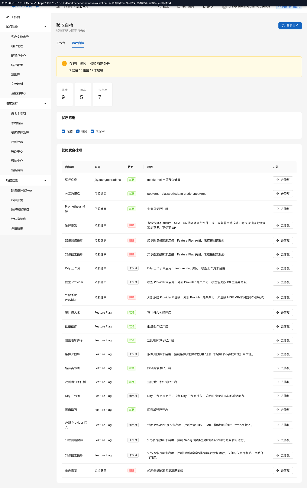

# MedKernel · 合规运维用户手册

> 状态：已由全流程演练幕0激活 · 后续由幕9、幕10补齐
> 适用：信息科管理员 / 安全审计 / 乙方 SRE / 国产化驻场运维
> 证据：幕0真实演练归档在 [部署接管与首次登录证据](../../release/evidence/v1.0-drill-20260611/幕0-部署接管与首次登录/README.md)

---

## 1. 首次部署

### 1.1 这页给谁干什么

首次部署给信息科管理员和实施运维使用。目标是把一个刚启动、尚未接管的 MedKernel 系统变成可登录、可审计、可继续开租户的系统。

本章覆盖三页：

| 页面 | 入口 | 用途 |
|---|---|---|
| 首次部署接管 | `/bootstrap` | 输入接管码，创建首发平台管理员 |
| 登录页 | `/login` | 完成首登改密和 MFA 绑定 |
| 验收自检 | `/workbench/readiness-validation` | 查看全系统就绪、阻塞、未启用项 |

浏览器入口不带 `/medkernel` 前缀；`/medkernel/api/v1/*` 只用于后端 API。

### 1.2 进入入口

1. 访问 `https://<服务器地址>/bootstrap`。
2. 从服务器受限文件读取接管码，确认文件权限为仅运维账号可读。
3. 接管完成后访问 `https://<服务器地址>/login`。
4. 登录后进入 `https://<服务器地址>/workbench/readiness-validation` 查看验收自检。

幕0证据中，193.112.107.134 的首发管理员为 `drill-platform-admin-20260611`，角色为 `system-superadmin`，租户为平台主租户 `t-1`。口令和恢复码不进入仓库。

### 1.3 默认看到什么

| 页面 | 默认状态 | 判断方式 |
|---|---|---|
| 首次部署接管 | 初始化前显示接管码输入框 | `GET /medkernel/api/v1/bootstrap/status` 返回 `initialized=false` |
| 登录页 | 首次登录后强制改密 | 登录响应提示必须修改初始口令 |
| MFA 绑定 | 改密后要求绑定双因素认证 | 页面展示 TOTP 绑定与一次性恢复码 |
| 验收自检 | 展示就绪、阻塞、未启用数量和修复入口 | 幕0复验为 9 就绪 / 5 阻塞 / 7 未启用 |

验收自检中的「阻塞」不是伪失败，也不是静态红字；它表示当前系统真实缺少某项上线前置条件。例如幕0中备份恢复、外部 Provider、知识图谱投影、知识搜索投影仍需后续幕次或现场资源补齐。

### 1.4 七步流操作

| 步骤 | 操作 | 通过信号 |
|---|---|---|
| 1 | 打开 `/bootstrap` | 页面能打开，未接管时 API 返回 `initialized=false` |
| 2 | 输入接管码 | 接管码校验通过，页面进入首发账号表单 |
| 3 | 创建首发平台管理员 | 系统创建 `system-superadmin` 账号，并消费接管码 |
| 4 | 使用首发账号登录 | 登录成功但被要求立即改密 |
| 5 | 修改初始口令 | `mustChangePwd=false` |
| 6 | 绑定 MFA | `mfaRequired=true` 且 `mfaBound=true` |
| 7 | 打开验收自检页 | 页面展示就绪、阻塞、未启用项，并能保留 traceId |

每一步的页面截图、API 状态码和 traceId 见 [幕0证据 README](../../release/evidence/v1.0-drill-20260611/幕0-部署接管与首次登录/README.md)。

### 1.5 出错怎么办

| 现象 | 常见原因 | 处理 |
|---|---|---|
| `/medkernel/` 返回 401 | 访问了后端根路径，不是前端入口 | 改访问 `/bootstrap` 或 `/login` |
| 接管码不可用 | 过期、已消费、环境变量未注入 | 由值班运维重新生成并写入受限文件，留审计 |
| 首登后不能继续 | 未完成改密或 MFA | 按页面顺序完成改密、TOTP 绑定 |
| 验收自检页显示权限不足 | 账号没有工作台权限，或服务器前端资源滞后 | 先查 `/security/me` 的角色和权限；若 API 权限正确，重新发布前端静态资源 |
| MFA 设备丢失 | 恢复码不可用或未妥善保管 | 走本机应急命令；工单记录操作者、原因、目标用户和 traceId，不记录恢复码明文 |

### 1.6 找谁

- 接管码、部署变量、服务器文件权限：值班运维 / 乙方 SRE。
- MFA 重置、账号解锁：安全审计负责人批准后由值班运维在本机控制台执行。
- 验收自检阻塞项：先看页面「原因」列；外部 Provider、备份恢复、知识图谱和知识搜索投影由对应实施负责人处理。
- 前端入口或权限显示与 API 不一致：保留截图、traceId、`/security/me` 响应和当前前端发布记录，交由产品工程排查。
