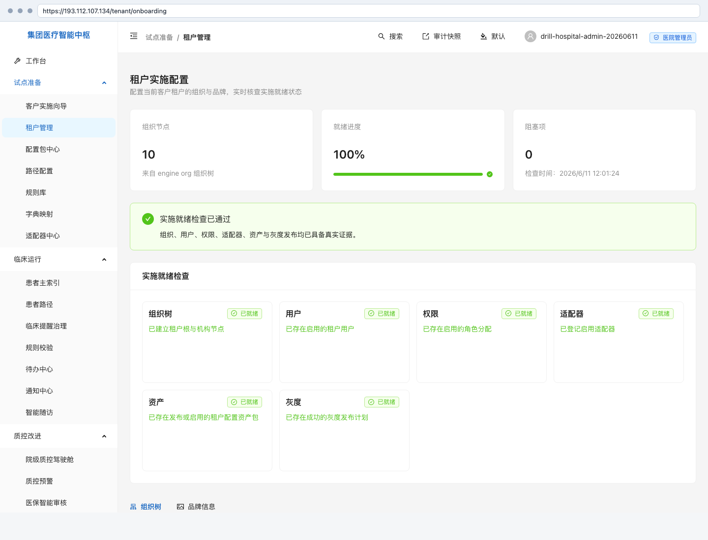
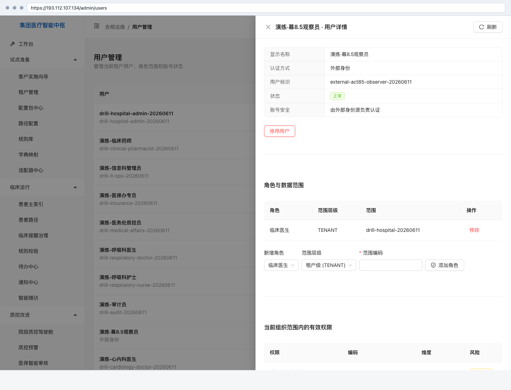
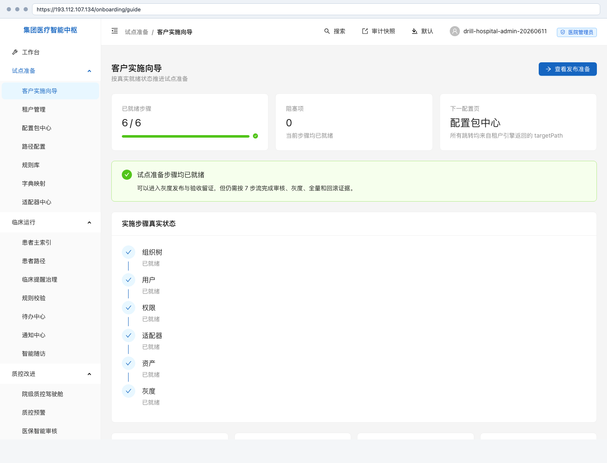
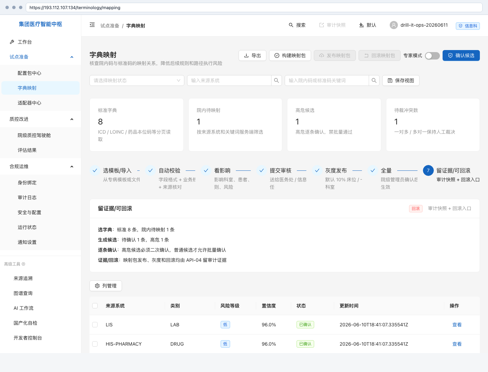
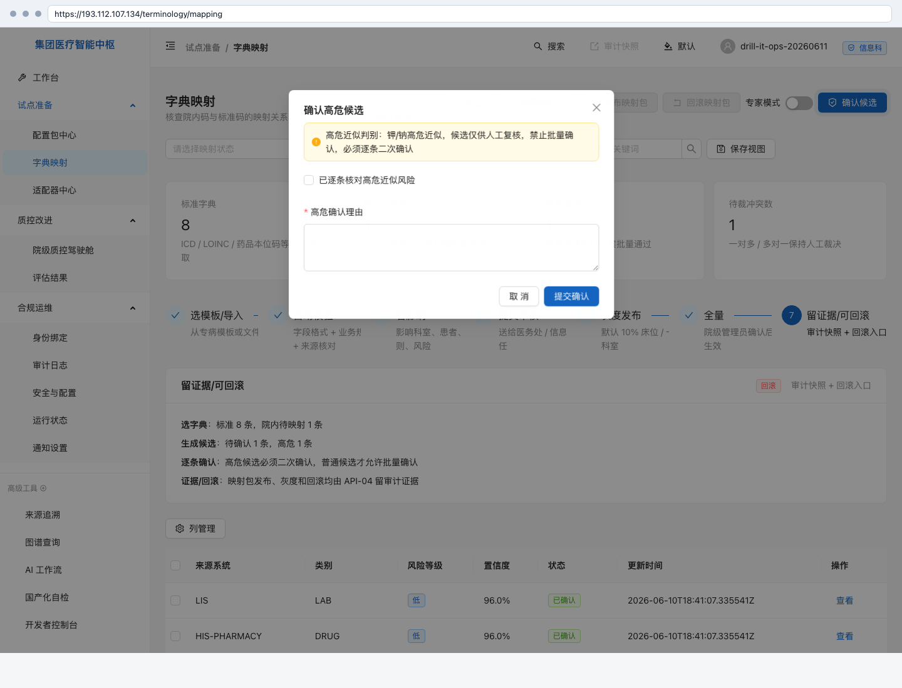
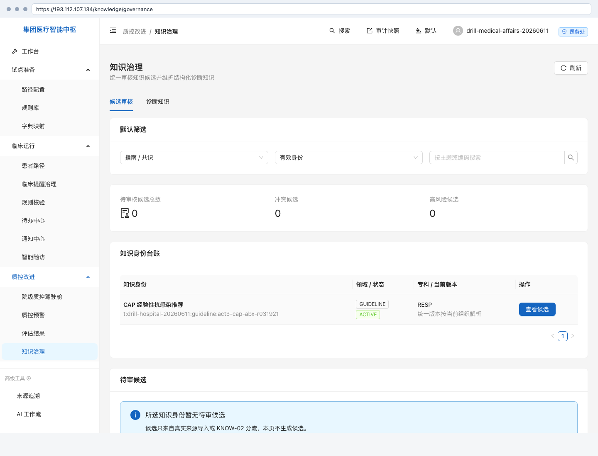
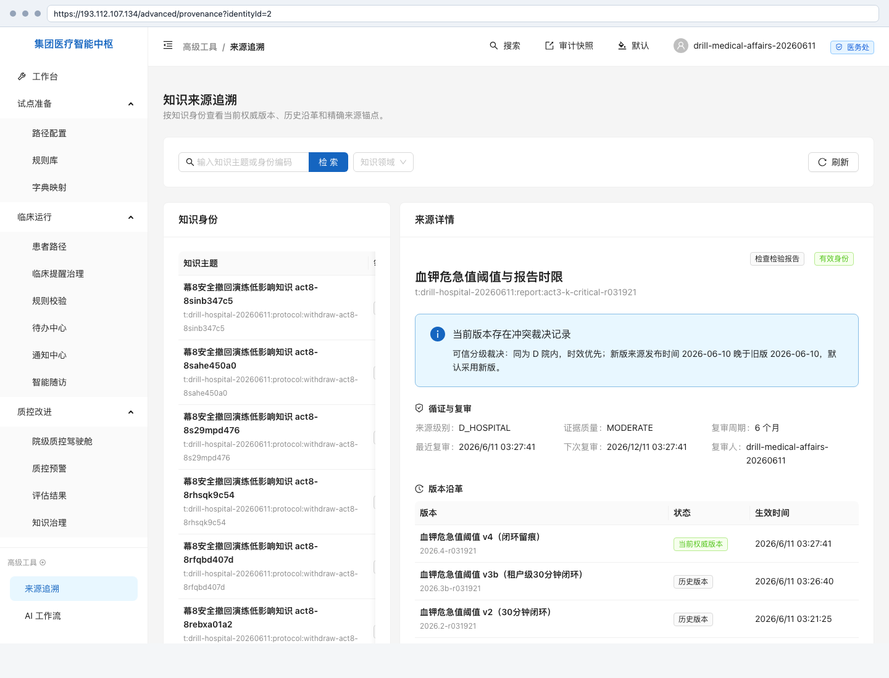
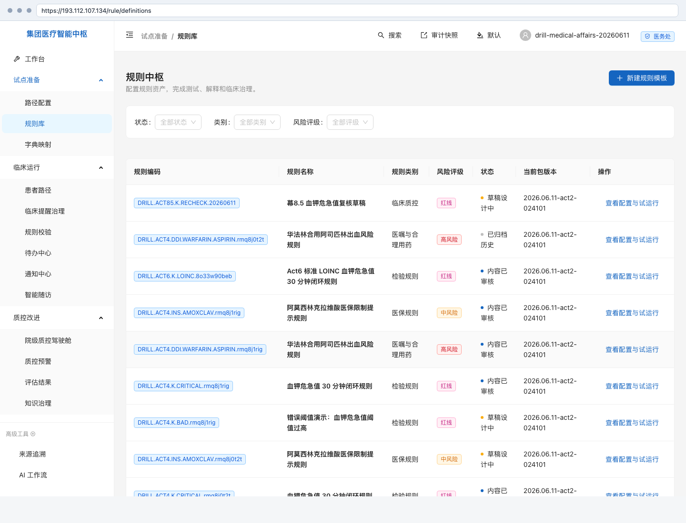
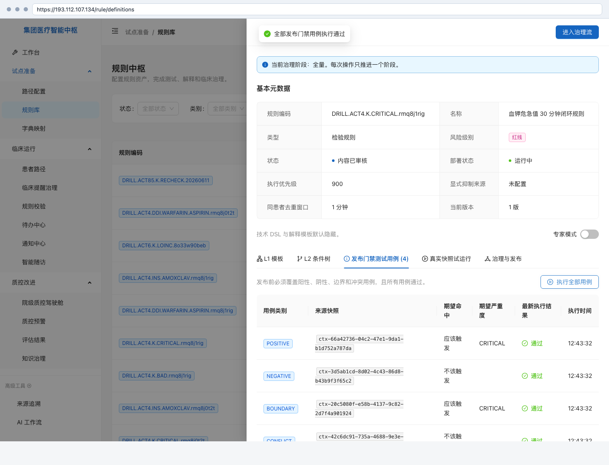
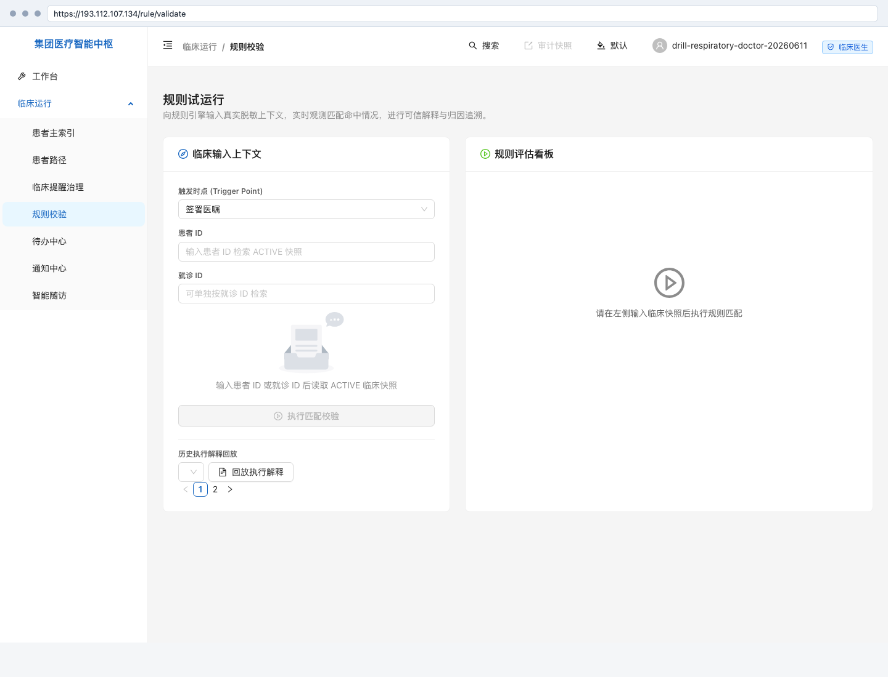

# MedKernel · 试点准备用户手册

> 状态：已由全流程演练幕1激活 · 幕8.5 已补齐幕1-4 前台复演配图和体验缺口 · 幕8配置包与发布治理已补齐；幕5临床路径运行见《临床运行用户手册》
> 适用：信息科主任 / 实施工程师 / 医务处牵头人 / 科室联络人
> 证据：幕1真实演练归档在 [租户、组织与用户证据](../../release/evidence/v1.0-drill-20260611/幕1-租户组织与用户/README.md)；幕2真实演练归档在 [字典与术语对照证据](../../release/evidence/v1.0-drill-20260611/幕2-字典与术语对照/README.md)；幕3真实演练归档在 [知识治理证据](../../release/evidence/v1.0-drill-20260611/幕3-知识治理/README.md)；幕4真实演练归档在 [规则配置与模拟证据](../../release/evidence/v1.0-drill-20260611/幕4-规则配置与模拟/README.md)；幕8真实演练归档在 [配置包与发布治理证据](../../release/evidence/v1.0-drill-20260611/幕8-配置包与发布治理/README.md)

---

## 1. 租户与组织

### 1.1 这页给谁干什么

租户与组织给信息科和实施工程师使用。目标是先把医院从平台主租户中分离出来，再建立医院、科室和后续规则适用范围。

本章覆盖两页：

| 页面         | 入口                                     | 用途                               |
| ------------ | ---------------------------------------- | ---------------------------------- |
| 客户租户开通 | `/tenant/onboarding`（平台主租户登录时） | 开通独立客户租户和首个医院管理员   |
| 租户实施配置 | `/tenant/onboarding`（客户租户登录时）   | 建组织树、看就绪状态、维护品牌信息 |

浏览器入口不带 `/medkernel` 前缀；`/medkernel/api/v1/*` 只用于后端 API。

### 1.2 进入入口

1. 用平台首发管理员登录平台主租户 `t-1`。
2. 打开 `/tenant/onboarding`，开通客户租户。
3. 用客户租户管理员登录新租户。
4. 再打开 `/tenant/onboarding`，进入租户实施配置视图。

幕1证据中，134 已开通客户租户 `drill-hospital-20260611`，名称为「演练总医院」；首个医院管理员为 `drill-hospital-admin-20260611`。凭据只存服务器 `/zoesoft/medkernel/conf/drill-act1-credentials-20260611.json`，不进入仓库。

### 1.3 默认看到什么

| 区域     | 默认状态                                 | 幕1实证                                                                         |
| -------- | ---------------------------------------- | ------------------------------------------------------------------------------- |
| 组织节点 | 展示当前租户组织树数量                   | 幕1基线为 9 个；幕8.5 前台复演后现场为 10 个，新增/核对「演练·幕8.5门诊协同科」 |
| 就绪进度 | 展示组织、用户、权限、适配器、资产、灰度 | 组织 / 用户 / 权限已就绪；适配器 / 资产 / 灰度仍阻塞                            |
| 组织树   | 展示医院和科室节点                       | 医务处、信息科、医保办、心内科、呼吸与危重症医学科、检验科、药学部              |

幕1基线只完成组织、用户和权限；幕8.5 复演时，后续幕次已经补齐适配器、资产和灰度证据，因此页面显示 100% 就绪。讲解时要说明这是全流程演练推进后的现场状态，不是幕1当时的初始状态。

### 1.4 七步流操作

| 步骤 | 操作                 | 通过信号                                              |
| ---- | -------------------- | ----------------------------------------------------- |
| 1    | 平台管理员登录 `t-1` | `/security/me` 显示 `system-superadmin` 且 MFA 已绑定 |
| 2    | 开通客户租户         | 客户租户台账出现 `drill-hospital-20260611`            |
| 3    | 医院管理员首登改密   | 用户详情显示 `mustChangePwd=false`                    |
| 4    | 创建医院节点         | 组织树出现「演练总医院」医院节点                      |
| 5    | 创建科室             | 组织树出现 7 个科室节点                               |
| 6    | 复查实施向导         | 组织树、用户、权限三项显示已就绪                      |
| 7    | 保留证据             | 结构化响应、traceId 和页面截图归档到幕1证据目录       |

每一步的脱敏响应、traceId 和截图见 [幕1证据 README](../../release/evidence/v1.0-drill-20260611/幕1-租户组织与用户/README.md)。

### 1.5 出错怎么办

| 现象                 | 常见原因                                       | 处理                                                 |
| -------------------- | ---------------------------------------------- | ---------------------------------------------------- |
| 开通租户返回权限不足 | 平台管理员未绑定 MFA，或当前角色没有租户写权限 | 先完成 MFA，再查 `/security/me` 的角色和权限         |
| 登录后仍要求改密     | 初始口令尚未完成首登修改                       | 先完成改密再进入租户实施配置                         |
| 组织树无法新增节点   | 当前账号没有 `org.write`，或父级层级不合法     | 用医院管理员或信息科账号操作；确认科室挂在医院节点下 |
| 实施向导仍显示阻塞   | 对应幕次尚未完成，或真实数据未满足             | 查看卡片上的阻塞原因，不把阻塞项手工改成通过         |

## 2. 用户、角色与权限

### 2.1 这页给谁干什么

用户管理给医院管理员和信息科管理员使用。目标是创建试点期间真实会登录的人员账号，并确认每个人只看到自己角色应看的菜单。

本章覆盖两页：

| 页面         | 入口                | 用途                                         |
| ------------ | ------------------- | -------------------------------------------- |
| 用户管理     | `/admin/users`      | 创建平台管理凭证用户、查看角色和账号安全状态 |
| 客户实施向导 | `/onboarding/guide` | 汇总组织、用户、权限等实施状态               |

### 2.2 幕1账号清单

| 账号                                 | 对应岗位     | 角色     | 组织范围           |
| ------------------------------------ | ------------ | -------- | ------------------ |
| `drill-it-ops-20260611`              | 信息科管理员 | 信息科   | 当前租户           |
| `drill-medical-affairs-20260611`     | 医务处质控员 | 医务处   | 演练总医院         |
| `drill-insurance-20260611`           | 医保办专员   | 医保办   | 演练总医院         |
| `drill-cardiology-doctor-20260611`   | 心内科医生   | 临床医生 | 心内科             |
| `drill-respiratory-doctor-20260611`  | 呼吸科医生   | 临床医生 | 呼吸与危重症医学科 |
| `drill-respiratory-nurse-20260611`   | 呼吸科护士   | 护理人员 | 呼吸与危重症医学科 |
| `drill-lab-technician-20260611`      | 检验技师     | 医技技师 | 检验科             |
| `drill-clinical-pharmacist-20260611` | 临床药师     | 临床药师 | 药学部             |
| `drill-audit-20260611`               | 审计员       | 合规审计 | 当前租户           |

为避免角色矩阵留空，幕1还创建了 6 个角色可见性抽查账号，覆盖平台管理员、集团管理员、质控办主任、科主任、专科专家和实施工程师。连同幕0首发超级管理员和幕1医院管理员，16 个内置角色已全部登录核验。

幕8.5 复演新建/核对了外部身份观察员「演练·幕8.5观察员」。外部身份不生成页面临时密码，适合作为不泄露凭据的演示账号。

### 2.3 权限怎么验

用户权限不要只看「角色名称」。幕1按四件事交叉验证：

| 验证             | 证据                                                                              |
| ---------------- | --------------------------------------------------------------------------------- |
| 当前用户是谁     | `/security/me` 返回用户名、角色、权限和菜单 key                                   |
| 能看哪些菜单     | `/security/menu-permissions/visible` 返回实际侧边栏分组                           |
| 组织范围是否落库 | `/compliance/users/{userId}` 返回角色的 `TENANT` / `HOSPITAL` / `DEPARTMENT` 范围 |
| 越权是否被拒     | 医生读用户管理 403；审计员创建用户 403；审计流出现 `authorization` 失败事件       |

幕1结果：角色覆盖 16/16；9 个主账号全部能登录；所有平台管理凭证账号均完成首登设置；医生没有合规运维菜单；审计员没有写权限。

### 2.4 出错怎么办

| 现象               | 常见原因               | 处理                                                           |
| ------------------ | ---------------------- | -------------------------------------------------------------- |
| 用户看不到页面     | 角色没有对应菜单维权限 | 查 `/security/me` 的 `menuKeys`，不要只看用户名                |
| 用户能看但不能操作 | 只有读权限，没有写权限 | 查 `effectivePermissions`，由医院管理员调整角色或组织范围      |
| 医生看到了合规运维 | 权限覆盖配置异常       | 立即截图、保存 `/security/me` 响应和 traceId，回滚最近权限覆盖 |
| 审计员能写用户     | 违反审计独立原则       | 立即停用该角色分配，保留审计流，按安全事件处理                 |

### 2.5 找谁

- 租户开通和医院管理员账号：平台运维 / 信息科主任。
- 科室树和组织范围：实施工程师 / 医院信息科。
- 账号创建、改密、停用：医院管理员。
- 越权、审计、MFA 或账号安全问题：合规审计负责人。

## 3. 字典与术语对照

### 3.1 这页给谁干什么

字典映射给信息科、检验科和药学部使用。目标是把院内 HIS / LIS / 药房代码对齐到 ICD-10、LOINC、ATC 等标准代码，后续规则、路径和提醒才能引用同一套语言。

| 页面     | 入口                   | 用途                                           |
| -------- | ---------------------- | ---------------------------------------------- |
| 字典映射 | `/terminology/mapping` | 看标准字典、院内待映射、候选、冲突、映射包草稿 |

幕2在 134 上登记了 8 条标准术语和 4 条院内术语，证据目录为 `docs/release/evidence/v1.0-drill-20260611/幕2-字典与术语对照/`。

幕8.5 复演确认：字典映射页可以查看候选、冲突和映射包入口，但还不能在前台新建一条本地映射并走完替换/回滚全状态机；该缺口已进入体验重构清单。

### 3.2 本幕对照关系

| 院内来源     | 院内代码 | 院内名称        | 标准体系 | 标准代码           | 状态                     |
| ------------ | -------- | --------------- | -------- | ------------------ | ------------------------ |
| LIS          | `K001`   | 血钾            | LOINC    | `2823-3` 血清钾    | 已确认                   |
| HIS-PHARMACY | `Y2035`  | 华法林钠片2.5mg | ATC      | `B01AA03` 华法林   | 已确认                   |
| HIS-DIAG     | `ZD0456` | 社区获得性肺炎  | ICD-10   | `J15.9` 细菌性肺炎 | 已确认                   |
| LIS          | `NA001`  | 血钠            | LOINC    | `2823-3` 血清钾    | 高危待复核，不得批量确认 |

`ZD0456` 同时命中 `J18.9 肺炎`，系统保留一条一对多冲突，等待人工裁决。这个冲突不是错误，而是提醒客户不要把“肺炎”和“细菌性肺炎”混成同一条标准关系。

### 3.3 七步流操作

| 步骤 | 操作           | 通过信号                                                 |
| ---- | -------------- | -------------------------------------------------------- |
| 1    | 登记标准术语   | 标准字典数显示 8，含 ICD-10 / LOINC / ATC                |
| 2    | 登记院内术语   | 院内待映射出现 LIS、药房、诊断来源                       |
| 3    | 生成候选       | 候选总数 5，高危候选 1                                   |
| 4    | 拦截高危       | `NA001 血钠 -> 2823-3 血清钾` 标为高危，批量确认返回拒绝 |
| 5    | 确认普通候选   | 3 条普通候选批量确认，院内术语状态推进为已映射           |
| 6    | 查看冲突       | `ZD0456` 一对多冲突保留在冲突待裁区                      |
| 7    | 构建映射包草稿 | 生成 `TERM.DRILL.ACT2` 草稿包，等待发布适配器接入        |

高危候选必须逐条勾选确认并填写原因。幕2故意没有确认 `血钠 -> 血清钾`，因为这是临床安全红线。

### 3.4 出错怎么办

| 现象                     | 常见原因                                            | 处理                                                      |
| ------------------------ | --------------------------------------------------- | --------------------------------------------------------- |
| 页面看不到候选           | 还没有登记院内术语，或筛选条件把来源系统过滤掉      | 清空筛选，先确认标准字典和院内术语数量                    |
| 批量确认按钮不可用       | 队列里存在高危候选                                  | 先逐条处理高危候选，普通候选才能批量确认                  |
| 对照覆盖仍显示未覆盖     | 覆盖分析只统计已发布生效快照，草稿包不计入运行态    | 检查发布适配器；未发布前不得写成已覆盖                    |
| 一个院内码命中多个标准码 | 术语过宽或同义词重叠                                | 保留冲突，交由信息科和业务科室人工裁决                    |
| 页面不能新建或替换映射   | 当前前台只覆盖查看、候选确认、构建包、发布/回滚入口 | 不用 API 冒充前台完成；登记到能力可见性矩阵并进入体验重构 |

### 3.5 找谁

- 标准字典来源和版本：信息科 / 医务处。
- LIS、HIS、药房代码含义：对应系统负责人和业务科室。
- 高危近似候选：业务科室专家逐条复核。
- 映射包发布适配器：信息科集成负责人；幕4已为演练租户创建真实可探活的 REST 发布适配器，并把 `TERM.DRILL.ACT2@2026.06.11-act2-024101` 发布为 `ACTIVE`。院方生产 HIS / EMR / 配置库适配器仍需在幕8继续接入。

## 4. 知识治理与来源追溯

### 4.1 这页给谁干什么

知识治理给信息科知识管理员、医务处质控员和知识包负责人使用。目标是把指南、法规、院内制度或本地演练条款登记成可审核、可发布、可追溯的知识版本，后续规则、路径和提醒只能引用已发布版本。

| 页面     | 入口                                | 用途                                               |
| -------- | ----------------------------------- | -------------------------------------------------- |
| 知识治理 | `/knowledge/governance`             | 查看知识身份、候选会签、发布后的审核队列           |
| 来源追溯 | `/advanced/provenance?identityId=2` | 查看当前权威版本、历史版本、替代关系和精确来源锚点 |

幕3在 134 上登记了两个知识资产：`CAP 经验性抗感染推荐` 与 `血钾危急值阈值与报告时限`。公开来源包括 [CAP 2016 经验性抗感染相关指南发布页](https://www.medjournals.cn/journalContribute/getContributeInfo.do?bizId=2036) 和 [国家卫健委《医疗机构临床实验室管理办法》](https://www.nhc.gov.cn/zwgk/wtwj/201304/f4d5cbc861fd43bb928d6ea124f87a19.shtml)；血钾资产的运行态版本引用的是演练医院危急值目录锚点，不把公开法规文本伪造成院内阈值。

幕8.5 复演确认：知识治理页是“台账 + 候选审核台”，页面明确提示候选来自真实来源导入或 KNOW-02 分流，本页不生成候选。也就是说，客户不能在该页完成“登记知识源→拆条目→建资产版本”的完整动作；这已登记为 `OPT-KNOW-UI-01`。

### 4.2 本幕知识资产

| 知识资产                 | 身份编码                                                   | 当前权威版本     | 来源证据                 | 状态                       |
| ------------------------ | ---------------------------------------------------------- | ---------------- | ------------------------ | -------------------------- |
| CAP 经验性抗感染推荐     | `t:drill-hospital-20260611:guideline:act3-cap-abx-r031921` | `2026.2-r031921` | CAP 指南来源片段         | 已发布                     |
| 血钾危急值阈值与报告时限 | `t:drill-hospital-20260611:report:act3-k-critical-r031921` | `2026.4-r031921` | 演练总医院危急值目录锚点 | 已发布，旧租户级版本已替代 |

知识治理页截图中候选数为 0，是会签发布后队列被清空的正确状态。来源追溯页中，血钾资产展示 1 个当前权威版本、3 个历史版本和精确来源锚点。

### 4.3 七步流操作

| 步骤 | 操作                   | 通过信号                                               |
| ---- | ---------------------- | ------------------------------------------------------ |
| 1    | 登记来源文档           | CAP、国家卫健委、演练危急值目录均生成来源记录          |
| 2    | 登记来源版本           | 每个来源都有版本号、发布时间、权威级别和适用范围       |
| 3    | 拆分来源锚点           | 片段记录锚点路径、片段指纹和引用权重                   |
| 4    | 创建知识身份           | 生成指南类和检验报告类两个知识身份                     |
| 5    | 创建知识版本并绑定引用 | 未绑定来源引用时发布被拒绝                             |
| 6    | 医务处会签并发布       | 高风险版本没有电子签名时发布被拒绝；签名齐全后发布     |
| 7    | 追溯与升级             | 来源追溯展示当前版本、历史版本、替代关系和精确来源锚点 |

幕3还实测了重复内容跳过、跨来源引用拒绝、引用片段偏移校验、候选审核端点必须使用 `CandidateClassification.id` 等护栏。前端知识治理页已同步修正会签提交 ID，避免把候选版本 ID 误传给审核接口。

### 4.4 出错怎么办

| 现象                   | 常见原因                                                                 | 处理                                                                                                            |
| ---------------------- | ------------------------------------------------------------------------ | --------------------------------------------------------------------------------------------------------------- |
| 发布返回需要来源引用   | 版本没有绑定来源片段                                                     | 先补引用；不得手工绕过发布                                                                                      |
| 高风险版本发布失败     | 缺少电子签名或签名摘要                                                   | 医务处质控员补齐签名 ID、签名人、签名时间和摘要                                                                 |
| 来源追溯没有当前版本   | 版本组织范围和当前登录上下文不一致                                       | 优先核对租户、医院、科室范围；幕3最终用租户级标准上下文发布                                                     |
| 跨来源引用被拒绝       | 当前模型要求版本引用同一来源版本下的片段                                 | 先按主来源发布；多来源证据增强已登记到待处理清单                                                                |
| 想退役客户租户知识身份 | 平台级退役接口只允许平台主租户执行，且知识治理页对租户角色不显示退役按钮 | 客户演练用新版本替代旧版本；平台退役留到平台主源治理阶段；后续由 `OPT-KNOW-UI-01` 补客户可见的新版本 / 退役向导 |

### 4.5 找谁

- 来源登记和锚点拆分：信息科知识管理员。
- 高风险知识会签：医务处质控员或授权专家。
- 院内制度和危急值目录：对应制度主管科室。
- 来源追溯异常：知识管理员先查当前组织范围，再交由实施工程师核对接口响应和 traceId。

## 5. 规则配置与模拟

### 5.1 这页给谁干什么

规则配置给医务处、医保办、药学部和医院管理员使用。目标是把已发布知识、已发布术语包和脱敏临床上下文组合成可测试、可会签、可解释、可灰度的临床规则。

本章覆盖两页：

| 页面       | 入口                | 用途                                                     |
| ---------- | ------------------- | -------------------------------------------------------- |
| 规则定义   | `/rule/definitions` | 创建规则、维护测试用例、查看影响分析、推进会签和发布阶段 |
| 规则试运行 | `/rule/validate`    | 选择临床上下文快照，观察规则命中、解释、动作和证据来源   |

幕4在 134 上先关闭幕2遗留的术语包发布阻塞：创建 REST 发布适配器 `drill-local-runtime-package-sink-20260611`，把 `TERM.DRILL.ACT2@2026.06.11-act2-024101` 发布为 `ACTIVE` 后，再执行规则演练。

幕8.5 复演用前台表单创建或复用了 `DRILL.ACT85.K.RECHECK.20260611` 草稿规则，只作为配置体验证据，不进入临床运行。

### 5.2 本幕规则清单

| 规则             | 责任角色                | 触发条件                                         | 提示等级 | 医疗安全要求                                             |
| ---------------- | ----------------------- | ------------------------------------------------ | -------- | -------------------------------------------------------- |
| 血钾危急值规则   | 医务处质控员            | `K001` 血钾 `>= 6.5 mmol/L` 或 `<= 2.5 mmol/L`   | 危急     | 医生必须复核，保留危急值 30 分钟闭环要求；不自动开立医嘱 |
| DDI 出血风险规则 | 医务处质控员 + 临床药师 | 华法林 `B01AA03` 与阿司匹林 `B01AC06` 合用       | 高       | 医生确认后由临床药师同行会签；不自动停药或改药           |
| 医保限制用药规则 | 医保办专员 + 医务处协调 | 阿莫西林克拉维酸 `J01CR02` 缺少限定诊断 `ZD0456` | 中       | 提示支付限制和补证依据；不阻断必要抢救用药               |

医保规则由医保办账号创建；进入租户级同行审核时由医务处账号提交，因为医保办账号没有 `tenant.override`。这不是权限缺陷，而是幕4按最小权限执行的真实结果。

### 5.3 八步流操作

| 步骤 | 操作                               | 通过信号                                                                  |
| ---- | ---------------------------------- | ------------------------------------------------------------------------- |
| 1    | 确认术语映射包已发布               | `TERM.DRILL.ACT2@2026.06.11-act2-024101` 状态为 `ACTIVE`                  |
| 2    | 创建临床上下文快照                 | 每条规则有正例、反例、边界、冲突 4 类快照，合计 12 个                     |
| 3    | 在规则定义页录入自然语言说明和 DSL | 规则生成 ID，并记录责任角色、适用范围、知识来源和术语引用                 |
| 4    | 维护测试用例                       | 正例命中、反例不命中、边界阈值和冲突场景均可单独回放                      |
| 5    | 运行规则测试                       | 测试全通过后才能提交同行审核；错误阈值规则被 `409` 阻断                   |
| 6    | 完成同行和委员会会签               | 医务处、药学部、科主任、质控角色按规则风险留下电子签名                    |
| 7    | 影子模式和灰度发布                 | 影子模式只记录命中和反馈，不生成医生端动作卡；灰度后再进入全量            |
| 8    | 在规则试运行页解释命中             | `/rule/validate` 展示命中规则、原因、动作、来源和执行日志；页面不补写归因 |

幕4的 3 条规则均有影子执行、全量执行和解释证据。错误阈值规则的同行审核 traceId 为 `act4-rmq8j1rig-bad-threshold-peer-denied`，返回 `409`，证明坏规则没有进入发布流。

幕8.5 也复跑了 R1 血钾危急值规则的发布门禁测试用例，页面显示阳性、阴性、边界、冲突四类用例均通过。

P1 规则可读路径已在规则详情补齐面向评审者的自然语言摘要和只读流程节点，把触发时点、适用范围、命中条件、处置动作、治理与安全约束从同一份 DSL 派生出来。呼吸科医生仍不进入规则配置页，这是权限边界；质控员、专科专家和科主任可在受控详情里按“规则可读路径”完成客户讲解，证据见 [规则可读路径 134 复验](../../release/evidence/v1.0-drill-20260611/P1-体验重构/规则可读路径-134复验/README.md)。

### 5.4 出错怎么办

| 现象                         | 常见原因                                                  | 处理                                                                                                         |
| ---------------------------- | --------------------------------------------------------- | ------------------------------------------------------------------------------------------------------------ |
| 规则试运行提示没有可用包版本 | 术语映射包仍是草稿或发布适配器不可用                      | 先检查配置包发布状态；草稿包不能当运行态使用                                                                 |
| 测试用例有失败               | DSL 阈值、字段路径、适用范围或上下文快照不匹配            | 停在草稿态修正，不能提交同行审核                                                                             |
| 同行审核被拒绝               | 当前角色没有签署权限，或规则测试未全通过                  | 换授权角色或先修测试；不得绕过会签                                                                           |
| 影子模式命中但医生端没有卡片 | 影子模式的设计就是只记录不打扰医生                        | 先看影子统计和反馈，再决定是否灰度                                                                           |
| 解释页看不到来源             | 规则创建时未绑定已发布知识或来源锚点                      | 回到规则定义补齐来源；页面不得手写理由伪造追溯                                                               |
| 医生读不懂或进不去规则库     | 医生角色没有配置页权限；配置讲解应由质控员 / 专科专家承担 | 质控或专科角色打开规则详情的“规则可读路径”，用自然语言摘要和只读流程节点讲清触发条件、处置动作和医疗安全边界 |

### 5.5 找谁

- 规则临床含义、风险等级和发布节奏：医务处质控员。
- 药物相互作用和用药复核：临床药师。
- 医保限定诊断和支付提示：医保办专员。
- 术语包发布适配器和上下文快照：信息科集成负责人。
- 高风险规则最终放量：医院管理员、科主任和质控负责人共同确认。

## 6. 配置包与发布治理

### 6.1 这页给谁干什么

配置包与发布治理给信息科管理员、医务处质控员和医院管理员使用。目标是把字典、知识、规则和路径这些已验证资产打成可发布、可灰度、可撤回、可离线交付的配置包，让第二阶段批量分发不再靠人工逐项复制。

本章覆盖两页和一条离线链路：

| 页面或链路 | 入口                                | 用途                                                          |
| ---------- | ----------------------------------- | ------------------------------------------------------------- |
| 配置包中心 | `/config/packages`                  | 创建配置包草稿、绑定资产条目、校验条目和导出离线包            |
| 发布治理   | `/config/releases`                  | 建发布计划、灰度、全量、查看同步日志和执行安全撤回            |
| 离线包对账 | 后端 `KnowledgeExport` / 包差异导出 | 校验 manifest、摘要和资产快照，供离线院区或封闭网络导入前复核 |

幕8在 134 上使用批次 `act8-8sinb347c5`，配置包为 `DRILL.ACT8.CONFIG.ACT8-8SINB347C5@2026.06.11-act8-8sinb347c5`，全量发布后状态为 `ACTIVE`。

### 6.2 默认看到什么

| 区域       | 应看到的业务信号               | 幕8实证                                                                                          |
| ---------- | ------------------------------ | ------------------------------------------------------------------------------------------------ |
| 配置包条目 | 每条条目可追溯到统一版本资产   | 字典、知识、规则、路径和撤回沙箱知识均来自前序真实演练资产                                       |
| 发布计划   | 草稿、灰度、全量和撤回状态清晰 | 灰度计划 `348c1ac9-d715-4e1f-b4e2-26b591697d56`，全量计划 `cb2db40d-cd7a-47b8-bd32-8204a22d5df3` |
| 灰度范围   | 只影响被选中的组织范围         | 呼吸科在灰度范围内，心内科不受影响                                                               |
| 同步日志   | 每次发布都有适配器同步记录     | 发布适配器 `drill-local-runtime-package-sink-20260611` 健康，同步日志 2 条                       |
| 离线导出   | manifest 与包体摘要一致        | 4 个条目、4 个资产快照，manifest 摘要与包体一致                                                  |
| 安全撤回   | 撤回后阻断继续放量             | 撤回后再发布返回 `400`，证明撤回红线生效                                                         |

### 6.3 七步流操作

| 步骤 | 操作                                   | 通过信号                                                            |
| ---- | -------------------------------------- | ------------------------------------------------------------------- |
| 1    | 选择已发布的字典、知识、规则和路径资产 | 条目能解析到统一版本资产；找不到资产时停在草稿校验                  |
| 2    | 创建配置包草稿并运行校验               | 草稿校验通过，包内条目、版本号、适用范围和来源摘要齐全              |
| 3    | 创建灰度发布计划                       | 范围只选呼吸科或指定试点科室，不默认全院                            |
| 4    | 执行灰度并检查边界                     | 试点科室可见新包；非试点科室不被影响                                |
| 5    | 创建全量发布计划                       | 灰度验证后再全量，生成同步日志和适配器回执                          |
| 6    | 导出离线包并对账                       | manifest 摘要、包体摘要、资产快照数量一致；重复导入应被对账保护拦截 |
| 7    | 执行安全撤回演示                       | 影响摘要可追溯；撤回后再次发布被阻断                                |

幕8的模拟导入返回 `409`，含义是目标侧已经存在同版本或需要人工对账，不是失败。演示讲解时应把它解释为“防止重复覆盖和静默污染”的保护机制。

### 6.4 幕8.5 前台复演怎么讲

| 现场问题                    | 页面               | 讲解截图                                                                                                                                                                                                                                                       |
| --------------------------- | ------------------ | -------------------------------------------------------------------------------------------------------------------------------------------------------------------------------------------------------------------------------------------------------------- |
| 配置包中心能不能找到这次包  | `/config/packages` | [配置包台账](../../release/evidence/v1.0-drill-20260611/幕8-配置包与发布治理/ui-replay/01-config-package-ledger.png)                                                                                                                                           |
| 发布时能不能看懂灰度 / 全量 | `/config/packages` | [发布弹窗](../../release/evidence/v1.0-drill-20260611/幕8-配置包与发布治理/ui-replay/02-config-package-release-modal.png)                                                                                                                                      |
| 发布治理页能做什么          | `/config/releases` | [影响模拟与灰度入口](../../release/evidence/v1.0-drill-20260611/幕8-配置包与发布治理/ui-replay/03-release-governance-simulation.png)、[覆盖模板](../../release/evidence/v1.0-drill-20260611/幕8-配置包与发布治理/ui-replay/04-release-governance-template.png) |

幕8.5 复演不重复执行真实全量发布或撤回，避免扰动幕8 L1 已经完成的放量 / 撤回证据。复演确认普通台账仍暴露业务编码和统一版本资产 / 包 ID，`OPT-PKG-01` 继续成立：默认视图应只保留业务信号，技术 ID 进入专家或调试视图。

### 6.5 出错怎么办

| 现象                               | 常见原因                                              | 处理                                                                 |
| ---------------------------------- | ----------------------------------------------------- | -------------------------------------------------------------------- |
| 配置包校验提示找不到规则或路径资产 | 页面看到的是业务 ID，统一版本库需要规则编码或路径编码 | 先确认规则、路径已经发布到统一版本资产；不得手工改包体绕过           |
| 灰度后非试点科室也看到新包         | 发布范围配置过宽，或组织范围继承解析错误              | 立即停止放量，核对发布计划范围和组织树语义范围                       |
| 离线导入返回 `409`                 | 目标侧已有同版本，或导入前对账发现冲突                | 进入人工对账，不要强制覆盖；幕8以 `409` 作为重复版本保护证据         |
| 撤回后仍能继续发布                 | 撤回状态没有进入发布前置校验                          | 停止演示并升级为医疗安全阻断缺陷；撤回后的包不得继续流入临床运行     |
| 适配器健康异常                     | 发布接收端断连或认证失败                              | 先看适配器中心健康状态和同步日志；无连接时诚实显示阻塞，不伪造已发布 |

### 6.6 找谁

- 配置包条目和离线包对账：信息科管理员。
- 灰度范围和放量节奏：医务处质控员、试点科室主任。
- 发布适配器和同步日志：信息科集成负责人。
- 安全撤回和影响确认：医院管理员、医务处质控员共同确认。
