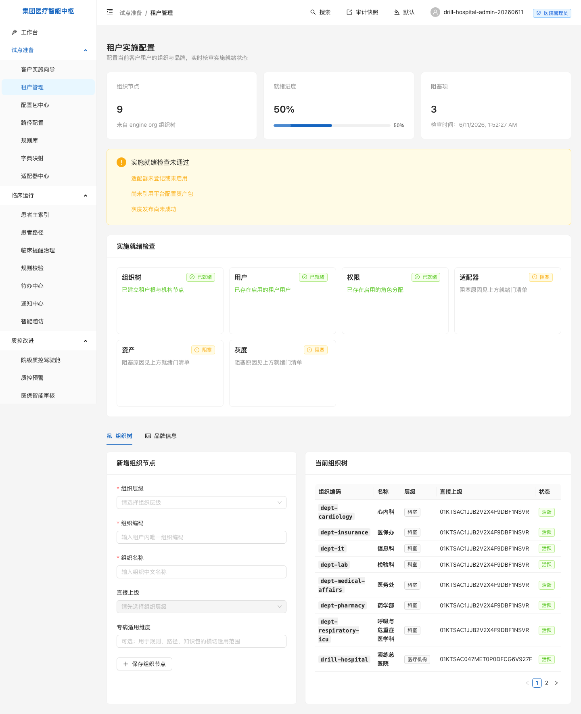
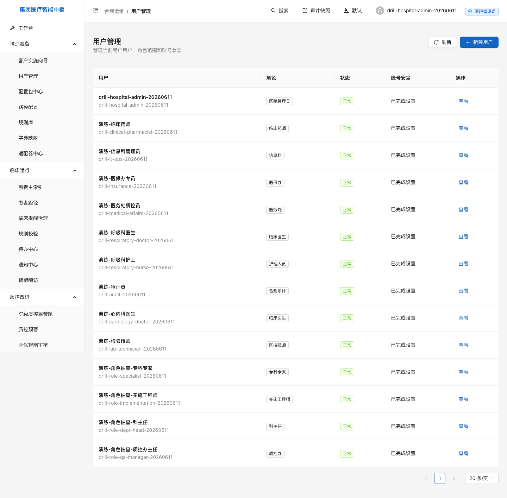
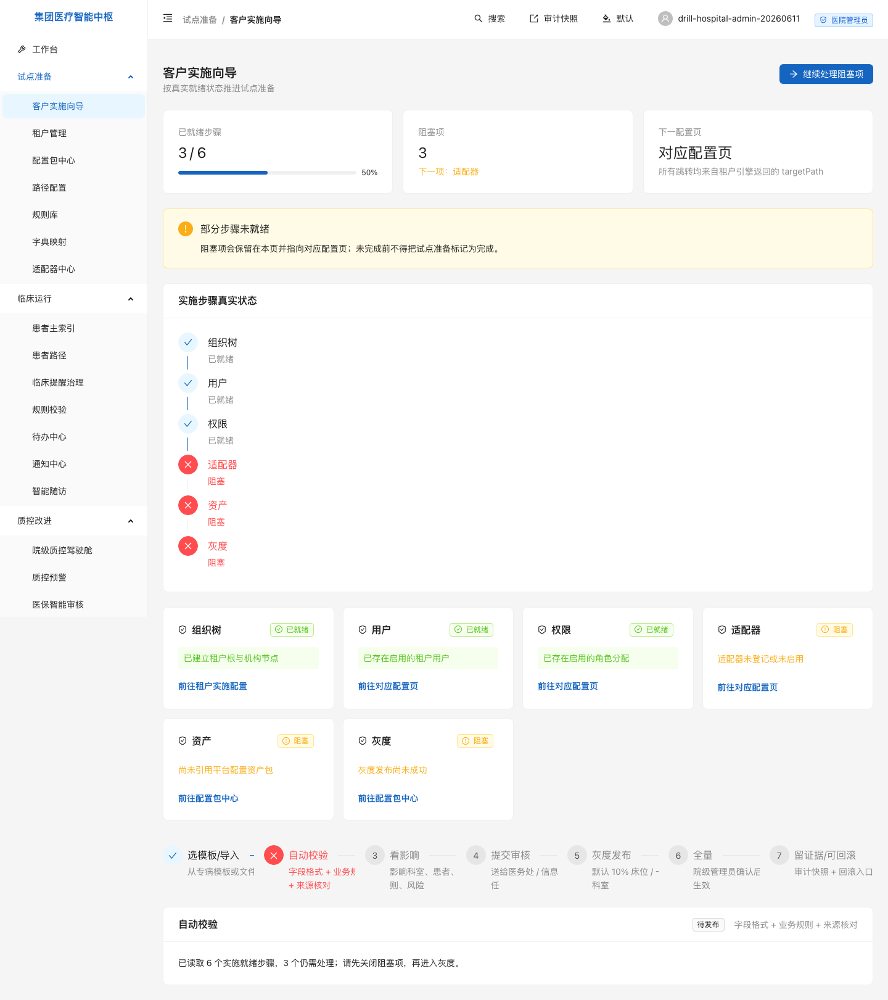
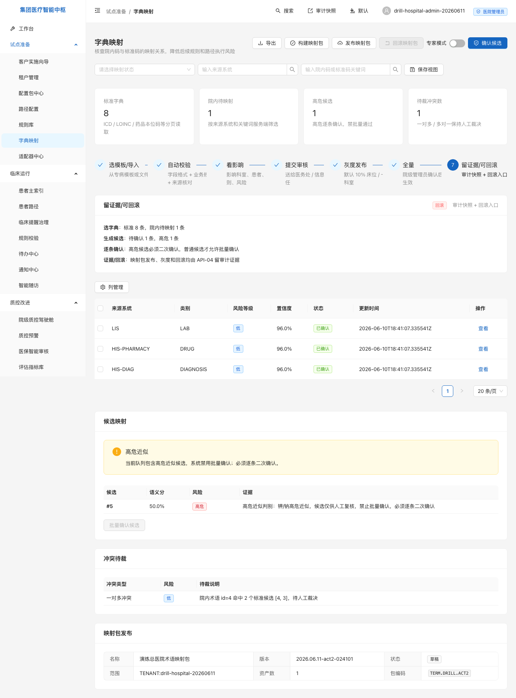
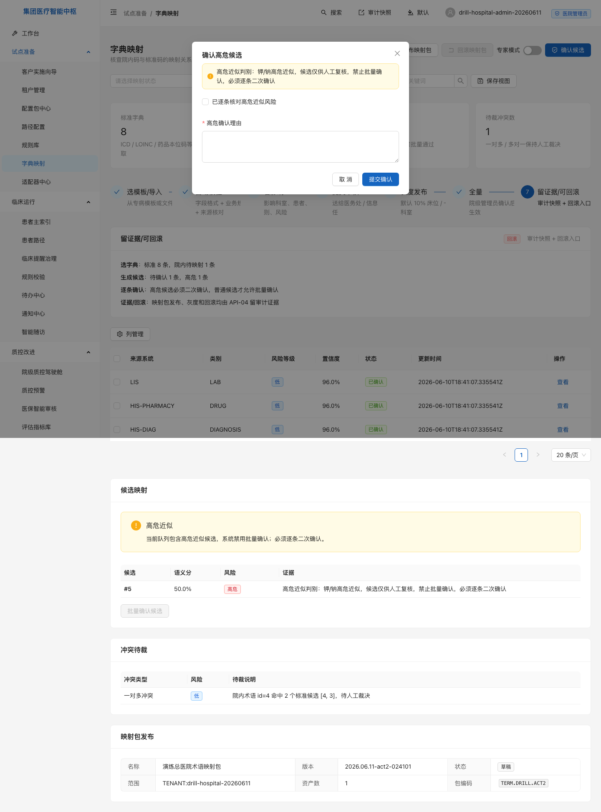

# MedKernel · 试点准备用户手册

> 状态：已由全流程演练幕1激活 · 幕2字典对照已补齐 · 后续由幕3-5、幕8补齐
> 适用：信息科主任 / 实施工程师 / 医务处牵头人 / 科室联络人
> 证据：幕1真实演练归档在 [租户、组织与用户证据](../../release/evidence/v1.0-drill-20260611/幕1-租户组织与用户/README.md)；幕2真实演练归档在 [字典与术语对照证据](../../release/evidence/v1.0-drill-20260611/幕2-字典与术语对照/README.md)

---

## 1. 租户与组织

### 1.1 这页给谁干什么

租户与组织给信息科和实施工程师使用。目标是先把医院从平台主租户中分离出来，再建立医院、科室和后续规则适用范围。

本章覆盖两页：

| 页面 | 入口 | 用途 |
|---|---|---|
| 客户租户开通 | `/tenant/onboarding`（平台主租户登录时） | 开通独立客户租户和首个医院管理员 |
| 租户实施配置 | `/tenant/onboarding`（客户租户登录时） | 建组织树、看就绪状态、维护品牌信息 |

浏览器入口不带 `/medkernel` 前缀；`/medkernel/api/v1/*` 只用于后端 API。

### 1.2 进入入口

1. 用平台首发管理员登录平台主租户 `t-1`。
2. 打开 `/tenant/onboarding`，开通客户租户。
3. 用客户租户管理员登录新租户。
4. 再打开 `/tenant/onboarding`，进入租户实施配置视图。

幕1证据中，134 已开通客户租户 `drill-hospital-20260611`，名称为「演练总医院」；首个医院管理员为 `drill-hospital-admin-20260611`。凭据只存服务器 `/zoesoft/medkernel/conf/drill-act1-credentials-20260611.json`，不进入仓库。

### 1.3 默认看到什么

| 区域 | 默认状态 | 幕1实证 |
|---|---|---|
| 组织节点 | 展示当前租户组织树数量 | 9 个组织节点：租户根、医院、7 个科室 |
| 就绪进度 | 展示组织、用户、权限、适配器、资产、灰度 | 组织 / 用户 / 权限已就绪；适配器 / 资产 / 灰度仍阻塞 |
| 组织树 | 展示医院和科室节点 | 医务处、信息科、医保办、心内科、呼吸与危重症医学科、检验科、药学部 |

幕1只完成组织、用户和权限。页面保留 3 个阻塞项是正确状态，不能为了演示把适配器、资产包和灰度发布伪造成已完成。

### 1.4 七步流操作

| 步骤 | 操作 | 通过信号 |
|---|---|---|
| 1 | 平台管理员登录 `t-1` | `/security/me` 显示 `system-superadmin` 且 MFA 已绑定 |
| 2 | 开通客户租户 | 客户租户台账出现 `drill-hospital-20260611` |
| 3 | 医院管理员首登改密 | 用户详情显示 `mustChangePwd=false` |
| 4 | 创建医院节点 | 组织树出现「演练总医院」医院节点 |
| 5 | 创建科室 | 组织树出现 7 个科室节点 |
| 6 | 复查实施向导 | 组织树、用户、权限三项显示已就绪 |
| 7 | 保留证据 | 结构化响应、traceId 和页面截图归档到幕1证据目录 |

每一步的脱敏响应、traceId 和截图见 [幕1证据 README](../../release/evidence/v1.0-drill-20260611/幕1-租户组织与用户/README.md)。

### 1.5 出错怎么办

| 现象 | 常见原因 | 处理 |
|---|---|---|
| 开通租户返回权限不足 | 平台管理员未绑定 MFA，或当前角色没有租户写权限 | 先完成 MFA，再查 `/security/me` 的角色和权限 |
| 登录后仍要求改密 | 初始口令尚未完成首登修改 | 先完成改密再进入租户实施配置 |
| 组织树无法新增节点 | 当前账号没有 `org.write`，或父级层级不合法 | 用医院管理员或信息科账号操作；确认科室挂在医院节点下 |
| 实施向导仍显示阻塞 | 对应幕次尚未完成，或真实数据未满足 | 查看卡片上的阻塞原因，不把阻塞项手工改成通过 |

## 2. 用户、角色与权限

### 2.1 这页给谁干什么

用户管理给医院管理员和信息科管理员使用。目标是创建试点期间真实会登录的人员账号，并确认每个人只看到自己角色应看的菜单。

本章覆盖两页：

| 页面 | 入口 | 用途 |
|---|---|---|
| 用户管理 | `/admin/users` | 创建平台管理凭证用户、查看角色和账号安全状态 |
| 客户实施向导 | `/onboarding/guide` | 汇总组织、用户、权限等实施状态 |

### 2.2 幕1账号清单

| 账号 | 对应岗位 | 角色 | 组织范围 |
|---|---|---|---|
| `drill-it-ops-20260611` | 信息科管理员 | 信息科 | 当前租户 |
| `drill-medical-affairs-20260611` | 医务处质控员 | 医务处 | 演练总医院 |
| `drill-insurance-20260611` | 医保办专员 | 医保办 | 演练总医院 |
| `drill-cardiology-doctor-20260611` | 心内科医生 | 临床医生 | 心内科 |
| `drill-respiratory-doctor-20260611` | 呼吸科医生 | 临床医生 | 呼吸与危重症医学科 |
| `drill-respiratory-nurse-20260611` | 呼吸科护士 | 护理人员 | 呼吸与危重症医学科 |
| `drill-lab-technician-20260611` | 检验技师 | 医技技师 | 检验科 |
| `drill-clinical-pharmacist-20260611` | 临床药师 | 临床药师 | 药学部 |
| `drill-audit-20260611` | 审计员 | 合规审计 | 当前租户 |

为避免角色矩阵留空，幕1还创建了 6 个角色可见性抽查账号，覆盖平台管理员、集团管理员、质控办主任、科主任、专科专家和实施工程师。连同幕0首发超级管理员和幕1医院管理员，16 个内置角色已全部登录核验。

### 2.3 权限怎么验

用户权限不要只看「角色名称」。幕1按四件事交叉验证：

| 验证 | 证据 |
|---|---|
| 当前用户是谁 | `/security/me` 返回用户名、角色、权限和菜单 key |
| 能看哪些菜单 | `/security/menu-permissions/visible` 返回实际侧边栏分组 |
| 组织范围是否落库 | `/compliance/users/{userId}` 返回角色的 `TENANT` / `HOSPITAL` / `DEPARTMENT` 范围 |
| 越权是否被拒 | 医生读用户管理 403；审计员创建用户 403；审计流出现 `authorization` 失败事件 |

幕1结果：角色覆盖 16/16；9 个主账号全部能登录；所有平台管理凭证账号均完成首登设置；医生没有合规运维菜单；审计员没有写权限。

### 2.4 出错怎么办

| 现象 | 常见原因 | 处理 |
|---|---|---|
| 用户看不到页面 | 角色没有对应菜单维权限 | 查 `/security/me` 的 `menuKeys`，不要只看用户名 |
| 用户能看但不能操作 | 只有读权限，没有写权限 | 查 `effectivePermissions`，由医院管理员调整角色或组织范围 |
| 医生看到了合规运维 | 权限覆盖配置异常 | 立即截图、保存 `/security/me` 响应和 traceId，回滚最近权限覆盖 |
| 审计员能写用户 | 违反审计独立原则 | 立即停用该角色分配，保留审计流，按安全事件处理 |

### 2.5 找谁

- 租户开通和医院管理员账号：平台运维 / 信息科主任。
- 科室树和组织范围：实施工程师 / 医院信息科。
- 账号创建、改密、停用：医院管理员。
- 越权、审计、MFA 或账号安全问题：合规审计负责人。

## 3. 字典与术语对照

### 3.1 这页给谁干什么

字典映射给信息科、检验科和药学部使用。目标是把院内 HIS / LIS / 药房代码对齐到 ICD-10、LOINC、ATC 等标准代码，后续规则、路径和提醒才能引用同一套语言。

| 页面 | 入口 | 用途 |
|---|---|---|
| 字典映射 | `/terminology/mapping` | 看标准字典、院内待映射、候选、冲突、映射包草稿 |

幕2在 134 上登记了 8 条标准术语和 4 条院内术语，证据目录为 `docs/release/evidence/v1.0-drill-20260611/幕2-字典与术语对照/`。

### 3.2 本幕对照关系

| 院内来源 | 院内代码 | 院内名称 | 标准体系 | 标准代码 | 状态 |
|---|---|---|---|---|---|
| LIS | `K001` | 血钾 | LOINC | `2823-3` 血清钾 | 已确认 |
| HIS-PHARMACY | `Y2035` | 华法林钠片2.5mg | ATC | `B01AA03` 华法林 | 已确认 |
| HIS-DIAG | `ZD0456` | 社区获得性肺炎 | ICD-10 | `J15.9` 细菌性肺炎 | 已确认 |
| LIS | `NA001` | 血钠 | LOINC | `2823-3` 血清钾 | 高危待复核，不得批量确认 |

`ZD0456` 同时命中 `J18.9 肺炎`，系统保留一条一对多冲突，等待人工裁决。这个冲突不是错误，而是提醒客户不要把“肺炎”和“细菌性肺炎”混成同一条标准关系。

### 3.3 七步流操作

| 步骤 | 操作 | 通过信号 |
|---|---|---|
| 1 | 登记标准术语 | 标准字典数显示 8，含 ICD-10 / LOINC / ATC |
| 2 | 登记院内术语 | 院内待映射出现 LIS、药房、诊断来源 |
| 3 | 生成候选 | 候选总数 5，高危候选 1 |
| 4 | 拦截高危 | `NA001 血钠 -> 2823-3 血清钾` 标为高危，批量确认返回拒绝 |
| 5 | 确认普通候选 | 3 条普通候选批量确认，院内术语状态推进为已映射 |
| 6 | 查看冲突 | `ZD0456` 一对多冲突保留在冲突待裁区 |
| 7 | 构建映射包草稿 | 生成 `TERM.DRILL.ACT2` 草稿包，等待发布适配器接入 |

高危候选必须逐条勾选确认并填写原因。幕2故意没有确认 `血钠 -> 血清钾`，因为这是临床安全红线。

### 3.4 出错怎么办

| 现象 | 常见原因 | 处理 |
|---|---|---|
| 页面看不到候选 | 还没有登记院内术语，或筛选条件把来源系统过滤掉 | 清空筛选，先确认标准字典和院内术语数量 |
| 批量确认按钮不可用 | 队列里存在高危候选 | 先逐条处理高危候选，普通候选才能批量确认 |
| 对照覆盖仍显示未覆盖 | 覆盖分析只统计已发布生效快照，草稿包不计入运行态 | 检查发布适配器；未发布前不得写成已覆盖 |
| 一个院内码命中多个标准码 | 术语过宽或同义词重叠 | 保留冲突，交由信息科和业务科室人工裁决 |

### 3.5 找谁

- 标准字典来源和版本：信息科 / 医务处。
- LIS、HIS、药房代码含义：对应系统负责人和业务科室。
- 高危近似候选：业务科室专家逐条复核。
- 映射包发布适配器：信息科集成负责人；当前幕2证据显示发布适配器为空，已登记为幕4前复核、幕8配置包发布阶段关闭的问题。
